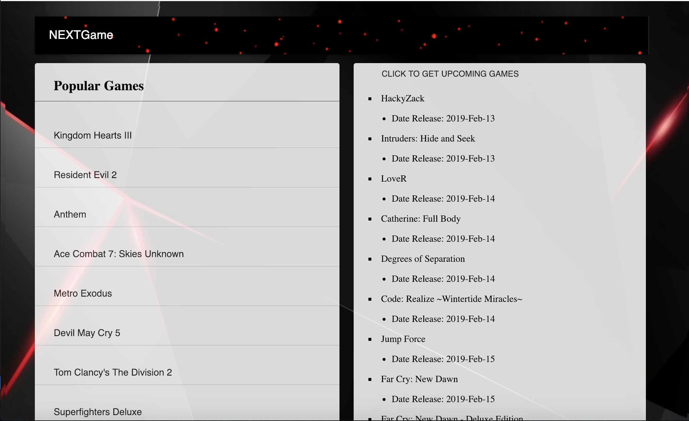

# Product-Perf

This application is for users to check the latest video games and view future releases using igbd API. The application releases a list of popular PS4 games and shows the user upcoming games with their release dates. This application is built with reactjs and since there are no relationships, there is no database use here to store information. Just a simple React JS application to check upcoming releases and popular video games. 


# Getting Started

Site Link: [NEXTGame](https://fierce-dusk-65498.herokuapp.com/)

After the welcome page, the main page will load to generate a list of popular games and a button when clicked will generate a list of upcoming games for the current month. 



All of the information is gathered from IGBD API and the organization with styling is with Material UI.

### Prerequisites

Your can access the site from any interest browser including [Google Chrome](https://www.google.com/chrome/), [Firefox](https://www.mozilla.org/en-US/firefox/new/), or [Safari](https://www.apple.com/safari/). 

# Deployment 

This site is deployed through [heroku](https://fierce-dusk-65498.herokuapp.com/) with repository with Github. 

# Built With

* React.js 
* Javascript/JQuery
* Material UI
* Heroku
* Yarn/Npm
    - Material UI
    - Express
    - Mongoose
    - Passport 
    - Axios 

# APIs and Libraries

* [IGBD](https://igdb.github.io/api/)

    INTERNET GAME DATABASE API 

* [Material-UI](https://material-ui.com/)

    React component that implements Google's Material Design 

# Code Snippets

1) The following code is set up to send a request to the API with axios and have the data returned as a JSON format to be used in App.js to call. The code below sends the user key (which is hidden) along with a request to get back the popular games or catch any error. 

```
router.get("/getPopular", (req, res) => {
    axios.get("https://api-endpoint.igdb.com/games/?fields=name,popularity&order=popularity:desc", {
    headers: {
      "user-key": "Hidden",
      // Accept: "application/json"
    }
  })
  .then(response => {
    // Do work here
    console.log(response.data);
    return res.json(response.data);
  })
  .catch(e => {
    console.log("error", e);
  });
});
```

# Author 
[Muhammad Awais](https://mawais54013.github.io/New-Portfolio/)

## Acknowledgments

* UCB Extension Coding Bootcamp 